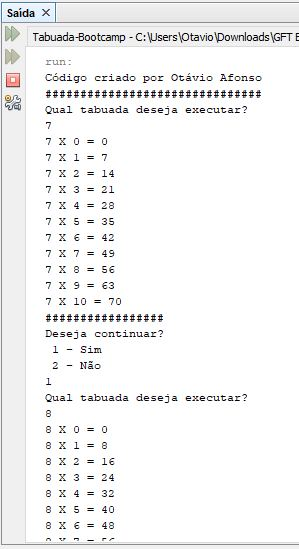

Exercicio proposto no BootCamp da GFT do curso "Lógica de Programação", aula "Trabalhando com laços de repetição em Portugol". Para solução do exercicio utilizei a IDE <i>NetBeans</i> e a linguagem JAVA. 

Exercicio:
 
<table>
  <ul>
    <li>Perguntar um numero ao usuário</li> 
    <li>Usar laço de repetiçao</li>
    <li>Exebir a tabuada do numero escolhido. </li>
  </ul>
</table>

<h2>ScreenShot Terminal de Saida</h2>

